---

# Movie and Review Scraper

This project is a web scraping tool designed to collect movie information and user reviews from the **FilmAffinity** website. It scrapes movie details, their respective review links, and iterates through multiple pages of user reviews for each movie, saving all the extracted data into a CSV file for further analysis.

## Features

- **Movie Data Collection**: The script scrapes a list of movies from FilmAffinity's Netflix category, including each movie's title and a direct link to its webpage.
- **Review Scraping**: For each movie, it identifies the link to the user reviews and iterates through several pages to gather detailed information on the users' reviews.
- **Data Extraction**: The script extracts key review details such as:
  - User nickname
  - Review rating
  - Review text
- **Error Handling & Retry Mechanism**: The script includes retries for failed requests (up to 5 times) and limits review page scraping to a maximum of 3 pages per movie.
- **CSV Export**: All scraped data is saved into a CSV file, including movie titles, review links, user names, ratings, and the text of the reviews.

## How It Works

The project consists of a main script that:
1. **Scrapes Movie Pages**: For each page of the Netflix movie category on FilmAffinity, it scrapes the movie titles and links.
2. **Collects Review Data**: After obtaining the movie's page, the script extracts the review link, navigates through up to 3 pages of reviews, and scrapes the details of each review.
3. **Saves Data**: All the movie details and their corresponding reviews are written to a CSV file for later use.

## Diagram

Here is an overview of how the application works:

### Output

The output will be stored in a CSV file named `peliculas_y_criticas.csv`. The file contains the following columns:

- Movie Title
- Movie Link
- Review Link
- Number of Reviews
- User Name
- User Rating
- Review Text

## Configuration

You can modify the `user_agents` list in the script to add different User-Agent headers to avoid getting blocked during the scraping process. Additionally, you can modify the base URL or limit the number of pages scraped by adjusting the pagination loop.

## Error Handling

- The script includes a retry mechanism that attempts up to 5 retries when failing to retrieve movie pages.
- For review pages, it retries up to 3 times in case the review section is not found or the page does not load properly.

---
